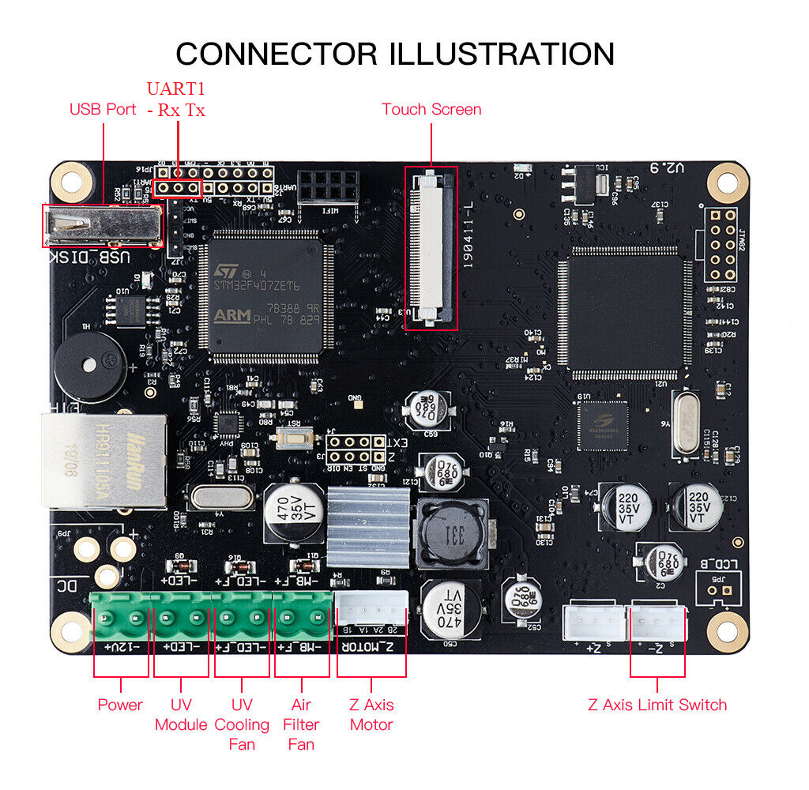
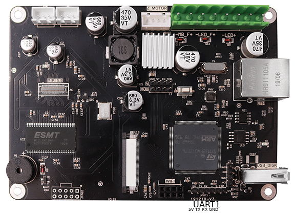
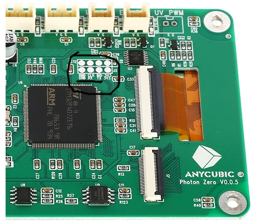

# Octoprint-Chituboard
Added basic support for chituboard based printers(Elegoo Mars, Anycubic Photon, Phrozen, etc.) to octoprint.
* upload files to folder `~/.octoprint/uploads/resin`
* pause and resume are still somewhat buggy due to a timeout issue
* File analysis CLI command works `octoprint plugins Chituboard:sla_analysis NAME`
* Todo: write model viewer to display layer slices and relevant info
    Anyone is welcome to take this on, I'm terrible at javascript

## Hardware setup
Hardware setup instructions

### Requirements
1. **Raspberry Pi Zero W, Zero WH, 3A+ or 4B** only supports raspberry pi's with USB-OTG ports
2. Supported printers: SLA printers with chitu3d mainboard
  * Anycubic Photon
  * Elegoo Mars
  * Elegoo Mars Pro
  * Elegoo Mars 2
  * Elegoo Mars 2 Pro
  * Elegoo Saturn
  * Phrozen Sonic Mighty 4K
  * Phrozen Sonic Mini 4K
  * Creality LD-002H
  * Creality LD-002R
  * Voxelab Proxima
  * Peopoly Phenom L
  * EPAX E10/X10

### Connecting Pi to printers USB port

Our goal here is to use the Pi as a USB flash drive. The printer mainboards use the USB port to read USB FAT storage devices not for serial control. The printer can only supply around 500 mA via the 5V line so its best to power you pi with an external power source.
Follow one of these steps.
1. Put some tape on the 5V line of your USB cable. This [tutorial](https://l9o.dev/posts/controlling-an-elegoo-mars-pro-remotely/) is a good reference on how to do this.
2. Cut the connection between the 5V line and the USB port on the Pi. Some people online do this, but I didn’t want to do any permanent changes to my Pi.
3. The USB-OTG port on the Raspberry pi 4B is also the USB host port
  * users should put tape on the USB-A end of your USB C to USB A cable
  * users will also need to power the pi via the GPIO pins, I suggest using the [X735](https://wiki.geekworm.com/X735).
  * users who forget to tape over the 5V pin on will risk frying their pi 4B

### Connecting the Pi to the printer’s serial port

Follow tutorial from [Mariner blog post](https://l9o.dev/posts/controlling-an-elegoo-mars-pro-remotely/) for more detailed hardware setup process.

Connect the jumper wires from the pi's UART0 port to the Elegoo Mars 2 motherboard like this.

pinout.xyz is a good reference if you’re unfamiliar with the Raspberry Pi’s GPIO pins. Note that the Pi’s TX pin is connected to the motherboard’s RX pin and vice-versa. Connect GND to GND, Rx to Tx, and Tx to Rx

**Anycubic Photon motherboard**

Solder a 3 pin header to UART1 located near the USB port on the board.

[Image source](https://github.com/Chasedog98/PhotonPi)

**ChiTu L V3 board**

UART1 port on chitu L V3 marked at bottom. Don't connect 5V line. Chitu mainboard can supply a max of 500 mA backpowering will cause brownouts.


**Anycubic Photon Zero motherboard**

This is a potential UART port on the Photon zero motherboard. I think its for the ESP-01S wifi chip which acts as a wifi UART bridge. You might be able to connect a PI to the RX and TX pins. Try this at your own risk I don't own this printer so I haven't tested this.



## Raspberry pi flash drive setup  
This script is intended for a fresh octopi installation on a Raspberry Pi Zero or raspberry pi 4

It will set up a folder on the Pi as a USB drive using the USB-OTG, create a sambashare, and a couple other things.

### Download
Either from this Github or using
`wget https://raw.githubusercontent.com/rudetrooper/Octoprint-Chituboard/main/Chituboard.sh`

### Prepare for execution
`sudo chmod +x ./Chituboard.sh`

### Execute
`sudo bash ./Chituboard.sh`

Follow the prompts in the script, reboot, and run once more.
You should see a different set of prompts on the second run

## Change octoprint settings
Modify config.yaml to match these settings
* Todo: finish writing settings mixin stuff so this can be configure during plugin install  
```yaml
serial:  
  abortHeatupOnCancel: false  
  additionalPorts:  
  - /dev/ttyS0  
  baudrate: 115200  
  blacklistedBaudrates:  
  - 9600  
  - 19200  
  - 57600  
  - 230400  
  capabilities:  
    autoreport_sdstatus: false  
    autoreport_temp: false  
  disconnectOnErrors: false  
  exclusive: false  
  externalHeatupDetection: false  
  firmwareDetection: false  
  helloCommand: M4002  
  ignoreErrorsFromFirmware: true  
  logPositionOnCancel: true  
  maxCommunicationTimeouts:  
    long: 0  
    printing: 0  
  neverSendChecksum: true  
  port: /dev/ttyS0  
  sanityCheckTools: false  
  sdAlwaysAvailable: true  
  timeout:  
    sdStatus: 3.0  
    sdStatusAutoreport: 0.0  
    temperature: 2.0  
    temperatureAutoreport: 0.0  
    temperatureTargetSet: 5.0  
  triggerOkForM29: false  
  unknownCommandsNeedAck: false  
  useParityWorkaround: never  
```
